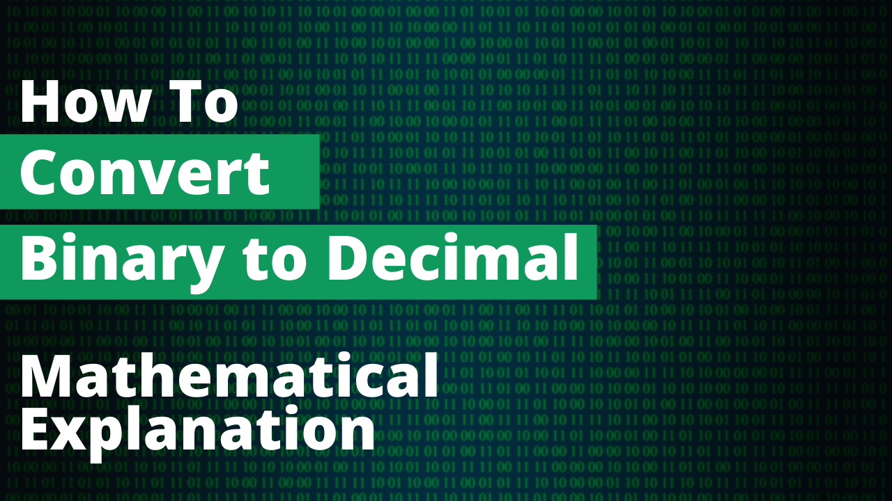

# How to Convert Binary to Decimal Number? Mathematically

In this tutorial I go over:

- What is a binary number?
- General Formula for binary to decimal conversion.
- Converting binary to decimal.

[](https://youtu.be/ys0Owag2_FA)

## What is a binary number?

A binary number is a number system that uses only two digits: 0 and 1. 

Each digit in a binary number is called a "bit" and the binary system uses powers of 2 to represent numbers. The rightmost digit represents the least significant bit, while the leftmost digit represents the most significant bit. The value of each digit is multiplied by 2 raised to the power of its position.

## General Formula for Binary to Decimal Conversions

```math
Decimal = Bit(n) * 2^n + Bit(n-1) * 2^(n-1) ... Bit(0) * 2^0
```

- Note - n is always 1 less than the length of binary number, since count begins from 0

## Converting Binary to Decimal

As a rule of thumb you add up powers of 2 for each bit that is not 0.
For a binary number "1101" the solution would be

```math
1101 => 8 + 4 + 0 + 1 => 13
```

Similarly for a larger binary number such as "1011 0111"

```math
1011 0111 => 128 + 0 + 32 + 16 + 0 + 4 + 2 + 1 => 183
```
